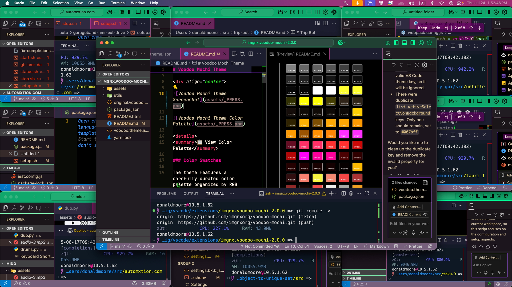
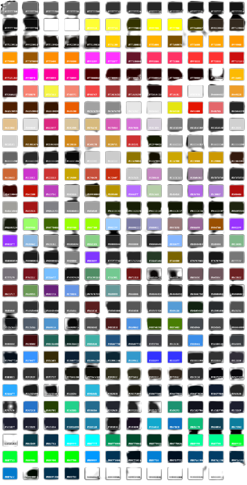

# Voodoo Mochi Theme

<!-- prettier-ignore -->
**Voodoo Mochi** is a thick, <b>bold</b> theme designed for those who want a mystical yet vibrant coding experience. With an intricate mix of glowing highlighters and deep dark backgrounds, this theme brings the essence of magical energy straight into your code editor.

## Preview

<!-- prettier-ignore -->
Here's a preview of the **Voodoo Mochi** theme in action, showcasing the mystical dark aesthetic with vibrant syntax highlighting:

📋 View Color Palette

### Color Swatches

The theme features a carefully curated color palette organized by RGB values, creating the perfect blend of
dark mysticism and vibrant energy.

## Features

- **Dark Aesthetic**: A deep, almost black background complemented by glowing highlights to create an
  immersive coding experience.
- **Vivid Syntax Highlighting**: Neon and vibrant colors for your code, making keywords, functions, and
  constants pop with energy.
- **Balanced Contrast**: High-contrast accents and highlighters scream with neon vibrancy, but the colors stay
  balanced, so they don't overpower the interface.
- **Customizable**: This theme can be further tweaked to suit your preferences, whether it's adding more neon
  or calming down the intensity.

### Highlighted Colors:

- **Keywords**: Neon orange, electric greens, and vibrant purples.
- **Functions**: Bold, bright green to keep your functions clear and distinct.
- **Strings & Constants**: Bright, eye-catching pinks and yellows for easy differentiation.
- **Variables**: From electric mint greens to darker shades for local variables, keeping your code sharp and
  easy to read.

> 💡 **Tip**: The theme looks best with font ligatures enabled and a programming font like Fira Code or
> JetBrains Mono.

## Installation

### Via Visual Studio Code

1. Open **VS Code**.
2. Go to the **Extensions** view (`Ctrl+Shift+X`).
3. Search for **"Voodoo Mochi"** or install directly from the settings if you have a `.vsix` file for it.
4. Once installed, go to **Preferences** → **Color Theme** → **Voodoo Mochi**.

### Manual Installation

1. Download the **Voodoo Mochi Theme** file.
2. Open the **VS Code** settings.
3. Place the theme file in your user **.vscode/extensions** folder.
4. Activate it in your **Settings** under **Color Theme**.

## Preview

<!-- prettier-ignore -->
Here’s a swatch preview of the colors included in the **Voodoo Mochi** theme. Each color has been designed to give your editor the perfect blend of dark mysticism and vibrant energy.

[Insert Swatch Preview Image]

## Customizing the Theme

If you'd like to customize the **Voodoo Mochi** theme to suit your personal preferences, feel free to adjust
the colors in the settings.json file. You can modify the following sections:

- **General UI Elements** (status bar, activity bar, editor background).
- **Syntax Highlighting** (keywords, variables, functions).
- **Editor Decorations** (selection background, cursor color).

For any advanced customizations, refer to
[VS Code Theme Documentation](https://code.visualstudio.com/docs/getstarted/keybindings).

## Contributions

- **Donald W. Moore Jr. [@imgnx](https://github.com/imgnx)**: Creator of Voodoo Mochi Theme.

If you have any ideas, suggestions, or improvements, feel free to fork the repository and contribute!

## License

This theme is available under the **MIT License**. Feel free to use, modify, and share it as you like.
